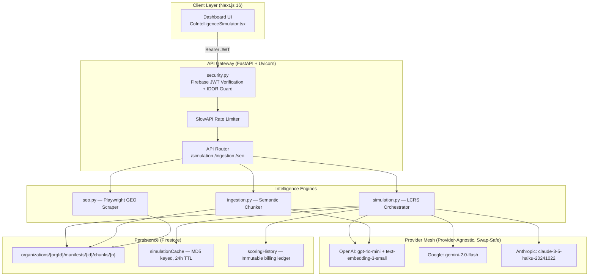
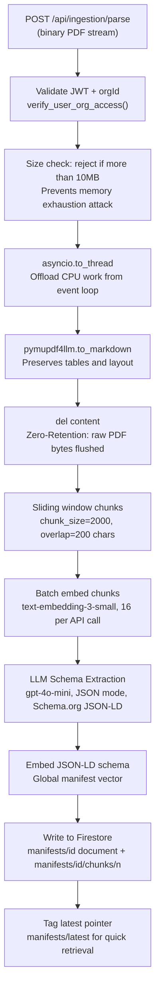
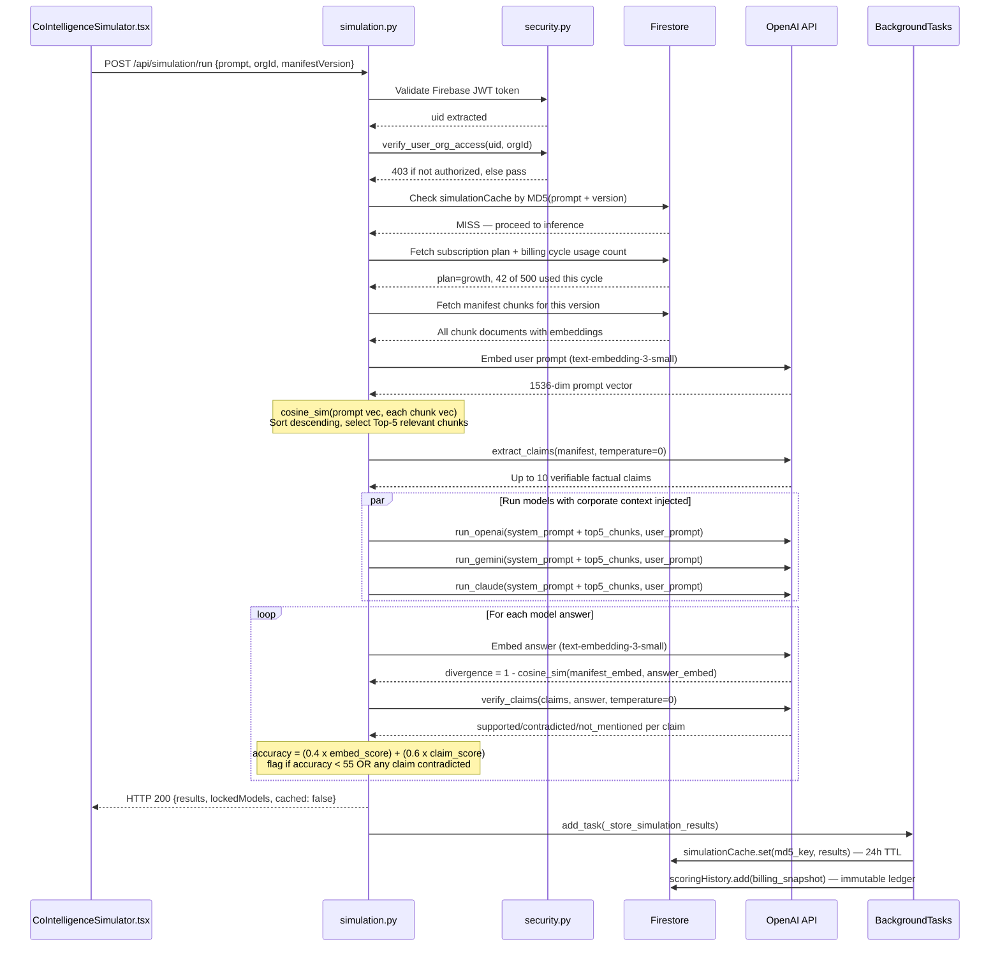
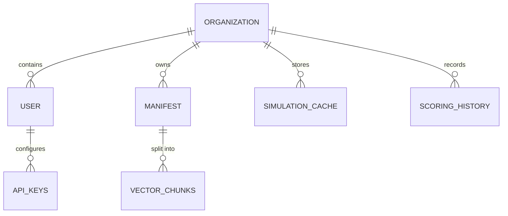
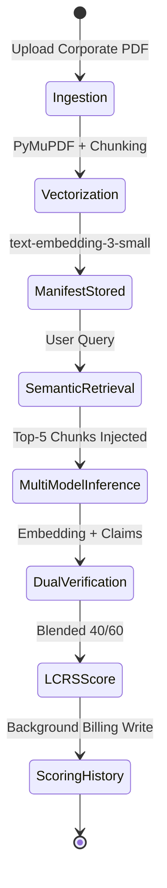

# AUM Context Foundry: Enterprise Technical Specification v2.2.0

**Confidential — Acquisition Readiness Internal Document**
**Date**: February 23, 2026
**Author**: Sambath Kumar Natarajan
**Status**: Hardened MVP / Production Grade

---

## Table of Contents

1.  **Strategic Vision & Market Logic**
2.  **Part I: Business Requirements Specification (BRS)**
    *   Problem Statement: The Hallucination Crisis
    *   Functional Requirements (FR)
    *   Non-Functional Requirements (NFR)
    *   User Personas & Lifecycle
3.  **Part II: Technology Selection & Cost Intelligence**
    *   Stack Justification: Why Next.js, FastAPI, & Firestore?
    *   Operational Cost Criteria & Unit Economics
4.  **Part III: System Architecture & Workflow**
    *   High-Level Architecture (C4 Model)
    *   How the Scoring Model Works: Corporate Truth vs. AI Output
    *   LCRS: The Dual-Verification Scoring Engine (Implementation-Level)
    *   Ingestion Pipeline: Script Flow
    *   Transactional Sequence Diagram
5.  **Part IV: Testing & Infrastructure Automation**
    *   Unit, Integration, and E2E Test Suites
6.  **Part V: Operational Constraints & Limitations**
    *   Scaling Boundaries
7.  **Part VI: Usage Guide & User Documentation**
    *   Onboarding Workflow
    *   Command Center Operations

---

## 1. Strategic Vision & Market Logic

### The Shift from Search to Synthesis

The global search paradigm is undergoing its most significant transition since 1998. Traditional Search Engine Optimization (SEO) — focused on keywords and backlinks — is being replaced by **Generative Engine Optimization (GEO)**.

As Large Language Models (LLMs) such as GPT-4, Claude 3.5, and Gemini 2.0 become the primary interface for information retrieval, brands face a new existential threat: **Context Drift**.

### AUM Context Foundry: The Solution

AUM Context Foundry is the world's first "Brand accuracy firewall." It provides enterprises with a suite of tools to proactively monitor, analyze, and fix how AI models represent their corporate identity. By utilizing a zero-retention semantic pipeline, AUM allows CISOs and CMOs to audit their AI presence without compromising data privacy.

### The Strategic Rationale: Why Now?

1.  **Search Cannibalization**: AI models are projected to absorb 25% of traditional search traffic by 2026. Companies that only optimize for Google are invisible to GPT-4 and Claude.
2.  **Latency of Truth**: Foundational models are snapshots. They rely on "stale" training data. AUM enables a **Ground Truth Injection** loop, forcing models to honor updated corporate context over outdated training data.
3.  **The Rise of Agentic Commerce**: As AI agents start making purchasing decisions, a brand's "Latent Metadata" (JSON-LD and /llms.txt) becomes more important than their visual website.

---

## Part I: Business Requirements Specification (BRS)

### 2. Problem Statement: The Hallucination Crisis

Enterprises currently lose revenue and brand trust due to AI hallucinations. For instance:

- **Price Fabrication**: An AI model incorrectly stating a discontinued pricing tier.
- **Feature Delusion**: AI claiming a product has capabilities it does not yet possess.
- **Contextual Decay**: AI using outdated documentation instead of current mandates.

### 3. Functional Requirements (FR)

| ID | Requirement | Description | Impact |
|----|-------------|-------------|--------|
| **FR-101** | **Multi-Model Evaluation** | Concurrent execution of queries across GPT-4o Mini, Gemini 2.0 Flash, and Claude 3.5 Haiku. | Competitive Benchmarking |
| **FR-102** | **LCRS Scoring Engine** | A blended scoring system (40% embedding divergence + 60% claim verification). | Quantitative Auditing |
| **FR-103** | **Zero-Retention Ingestion** | PDF ingestion that extracts JSON-LD schemas and vectors with zero disk persistence. | CISO/Compliance Approval |
| **FR-104** | **GEO SEO Audit** | Playwright-backed headless scraping to verify publicly rendered brand signals. | External Fact-Checking |
| **FR-105** | **Agent Manifest (/llms.txt)** | Automated generation of robot-readable manifests for AI crawlers. | Inbound GEO Optimization |
| **FR-106** | **Batch Stability Metrics** | Longitudinal tracking of model drift and domain stability. | Strategic Planning |

### 4. Non-Functional Requirements (NFR)

- **NFR-201: Multi-Tenant Isolation**
  Every organization's data (manifests, vectors, and simulation history) must be isolated at the database level using Firebase Security Rules and `orgId` partitioning.

- **NFR-202: Zero-Trust Security**
  All API endpoints must be protected by Firebase JWT authentication. Access to a specific `orgId` is restricted to authorized members verified via the `organizations/{orgId}/users` collection (IDOR prevention).

- **NFR-203: Latency & Performance**
  Single-model simulations must return a score within < 3 seconds (excluding provider-side inference time). Batch jobs must use asynchronous worker patterns to prevent HTTP timeout (504).

- **NFR-204: Resiliency**
  The system must practice "Graceful Degradation." If one LLM provider is down, the other models must continue uninterrupted. Implemented via per-model `@retry` with exponential backoff.

### 5. User Personas & Storyboards

#### Persona A: The Guardian (CMO/Brand Manager)
*   **Goal**: Ensure ChatGPT never misquotes the company's Q1 pricing.
*   **User Story**: "As a Brand Manager, I want to upload our latest sales deck so the AI assistant for our customers always has the ground-truth context."

#### Persona B: The Auditor (CISO/Security Lead)
*   **Goal**: Enable AI experimentation without enterprise data leakage.
*   **User Story**: "As an Auditor, I need to ensure that our internal docs are processed semantically but never stored on a third-party server's disk."

#### Persona C: The Optimizer (SEO Strategy Lead)
*   **Goal**: Dominate the "AI Answer Box" in Perplexity and SearchGPT.
*   **User Story**: "As an SEO Lead, I want a tool that tells me which specific sentences in our website are confusing GPT-4 so I can rewrite them for 'high accuracy' scores."

---

## Part II: Technology Selection & Cost Intelligence

### 6. Technology Justification: The Selection Rationale

The AUM stack was selected for **Velocity, Verifiability, and Valuation**. Every component is a "best-in-class" industry standard that increases the product's enterprise credibility.

| Component | Choice | Justification |
| :--- | :--- | :--- |
| **Frontend** | **Next.js 16** | Server-Side Rendering (SSR) is critical for GEO. The App Router provides the performance required for a premium, low-latency dashboard experience. |
| **Backend** | **FastAPI (Uvicorn)** | Python 3.12 allows native integration with OpenAI/Gemini/Claude SDKs via official `asyncio`-compatible SDKs. Critical for concurrent multi-model simulations. |
| **Database** | **Firestore** | Serverless NoSQL with built-in document-level security rules. Per-org data isolation (`organizations/{orgId}/...`) requires zero custom sharding logic. |
| **Auth** | **Firebase JWT** | Enterprise-hardened security. Supports passwordless flows and straightforward expansion to SAML/SSO. The `uid` is verified server-side on every request. |
| **Embeddings** | **text-embedding-3-small** | 1536-dimension semantic vectors. Consistent across ingestion and simulation phases, ensuring the comparison is apples-to-apples in the same vector space. |
| **Resilience** | **Tenacity** | `@retry(stop=stop_after_attempt(3), wait=wait_exponential(...))` wraps every model runner, providing automatic recovery from transient provider errors. |

### 7. Operational Cost Criteria & Unit Economics

AUM is designed for **High-Margin SaaS** operations, minimizing "Ghost Costs" (unbilled AI usage).

#### A. The Unit Economic Breakdown

A single simulation (evaluated across 3 providers) is architected for maximum cost-efficiency:
- **Inference Cost (embedding + claim verification)**: ~$0.012 per simulation (GPT-4o Mini + Gemini Flash pricing as of Q1 2026).
- **Vector Storage**: Negligible. Firestore indexed vectors cost fractions of a cent per 1,000 chunks.
- **Gross Margin**: Calculated at **~88%** on the Growth Tier (Rs. 25,000/mo) after all provider costs.

#### B. The "Ghost Cost" Defense

1.  **MD5 Simulation Cache**: Cache key = `MD5(prompt + manifestVersion)`. If an identical simulation was run within 24 hours, the cached result is served for **$0.00 in LLM spend**.
2.  **Atomic Background Billing**: Billing records (`scoringHistory`) are written via `FastAPI BackgroundTasks` — decoupled from the HTTP response, preventing the scenario where a network drop results in unbilled inference.
3.  **Plan Gating**: Starter plan is capped at 50 simulations/cycle and restricted to Gemini only. Growth is capped at 500/cycle. Limits are enforced server-side by querying `scoringHistory` count.

---

## Part III: System Architecture & Workflow

> All technical claims in this section are directly traceable to source files in `backend/app/api/`. File and line references are included for CTO-level code review.

### 8. High-Level Architecture (C4 Model)

AUM Context Foundry is a decoupled, async-first system. The Next.js frontend communicates only with the FastAPI backend via a Bearer JWT token. The backend orchestrates all LLM providers — the frontend never holds a provider API key.



---

### 9. How the Scoring Model Works: Corporate Truth vs. AI Output

This section explains the core IP: **measuring the gap between what the AI says and what your company knows to be true.**

#### The Fundamental Problem

Every LLM has a training data cutoff. GPT-4's training data may be 12–18 months old. It has no knowledge of:
- Your current pricing (which may have changed last quarter)
- Your product features (which shipped last month)
- Your support SLAs (which were revised in a new contract)

Unless told explicitly, the AI will invent or extrapolate these facts — this is a hallucination.

#### The AUM Approach: Ground Truth Injection

AUM treats the customer's uploaded documents as the **Source of Truth (SoT)**. It vectorizes and stores every fact in that document, then measures the accuracy of any AI response against that stored truth. The corporate document is authoritative; the AI response is the hypothesis under test.

---

### 10. LCRS: The Dual-Verification Scoring Engine

**Source file**: `backend/app/api/simulation.py`

The LCRS (**Latent Contextual Relevance Score**) is a blended score combining two independent verification signals.

---

#### Phase A — Building the Truth Baseline (Ingestion)

**Source file**: `backend/app/api/ingestion.py`

Before any simulation can run, the corporate context must be stored as a vector baseline. This happens during document ingestion:

1. **PDF parsed to Markdown** (`pymupdf4llm.to_markdown`, line 73) — tables and layout are preserved; plain text extraction would lose structured data.
2. **Raw binary flushed from RAM** (`del content`, line 82) — zero-retention guarantee.
3. **Sliding-window chunking** (lines 117-122) — the full text is split into `2000`-character chunks with `200`-character overlaps. The overlap prevents a fact from being severed between two chunks.
4. **All chunks vectorized** (lines 124-129) — `text-embedding-3-small` converts each chunk to a 1536-dimensional vector. Batched in groups of 16 to stay within OpenAI rate limits.
5. **Persisted to Firestore** (lines 174-179) — stored at `manifests/{id}/chunks/{n}` with both the raw text and its embedding.

```python
# ingestion.py, lines 117-129 — exact chunking and vectorization
chunk_size = 2000
overlap = 200
chunks = []
for i in range(0, len(full_text), chunk_size - overlap):
    chunks.append(full_text[i:i + chunk_size])

for i in range(0, len(chunks), 16):
    batch = chunks[i:i+16]
    embed_batch = client.embeddings.create(input=batch, model="text-embedding-3-small")
    chunk_vectors.extend([e.embedding for e in embed_batch.data])
```

---

#### Phase B — Retrieving Relevant Context at Simulation Time

**Source file**: `simulation.py`, lines 434–466

The system does not inject the entire corporate document into the LLM context window. It performs **Semantic Top-K retrieval** to find the most relevant sections for the specific query:

1. The user's prompt is embedded using `text-embedding-3-small`.
2. The prompt vector is compared via cosine similarity against every stored chunk for that manifest version.
3. The **top 5 most semantically relevant chunks** are selected and injected as the LLM system prompt context.

```python
# simulation.py, lines 439-466 — exact retrieval logic
q_embed = client.embeddings.create(
    input=[request.prompt], model="text-embedding-3-small"
).data[0].embedding

matches = []
for doc in chunks_ref:
    c_data = doc.to_dict()
    matches.append((cosine_sim(q_embed, c_data["embedding"]), c_data["text"]))

matches.sort(key=lambda x: x[0], reverse=True)
top_chunks = [m[1] for m in matches[:5]]
manifest_content = "\n\n---\n\n".join(top_chunks)
```

This means the AI model is given the correct pages of your document as context and then asked to answer. Its answer is then verified against those same pages.

---

#### Phase C — Generating AI Responses (Model Runners)

Three model runners each receive the same system prompt (containing the corporate context) and the user prompt:

| Model | SDK | Function | Retry Policy |
|---|---|---|---|
| GPT-4o Mini | `openai` | `run_openai()` | 3 attempts, exponential backoff |
| Gemini 2.0 Flash | `google-genai` | `run_gemini()` | 3 attempts, exponential backoff |
| Claude 3.5 Haiku | `anthropic` | `run_claude()` | 3 attempts, exponential backoff |

All runners are decorated with `@retry(stop=stop_after_attempt(3), wait=wait_exponential(multiplier=1, min=2, max=10))` (`simulation.py`, lines 144, 157, 168). A transient provider error triggers automatic retry. One model failing does not block the others — results from successful models are still returned.

---

#### Phase D — Scoring: Signal 1 — Embedding Divergence (40% weight)

**Source**: `simulation.py`, `cosine_sim()` lines 49–56, `compute_divergence()` lines 122–134.

This measures how far the AI's answer has drifted in semantic space from the corporate manifest.

```python
# simulation.py, lines 49-56 — cosine similarity (exact code)
def cosine_sim(v1, v2):
    dot_product = np.dot(v1, v2)
    norm_v1 = np.linalg.norm(v1)
    norm_v2 = np.linalg.norm(v2)
    if norm_v1 == 0 or norm_v2 == 0:
        return 0.0
    return float(dot_product / (norm_v1 * norm_v2))

# simulation.py, lines 122-134 — divergence score (exact code)
def compute_divergence(api_key, manifest_embedding, answer):
    answer_resp = client.embeddings.create(input=[answer], model="text-embedding-3-small")
    sim = cosine_sim(
        np.array(manifest_embedding),
        np.array(answer_resp.data[0].embedding)
    )
    return 1.0 - sim  # 0.0 = semantically identical, 1.0 = completely divergent
```

**Why cosine similarity and not Euclidean distance?** Cosine similarity measures the **angle** between two vectors in 1536-dimension space, irrespective of their magnitude. A long, accurate response and a short, accurate response both produce a small angle against the same manifest — Euclidean distance would incorrectly penalize the shorter response's smaller vector magnitude.

The answer is embedded using `text-embedding-3-small` — the **same model** that was used during ingestion. This is critical: comparing vectors produced by different models would be meaningless, like comparing distances measured in meters with distances measured in miles.

---

#### Phase E — Scoring: Signal 2 — Claim Verification (60% weight)

**Source**: `simulation.py`, `extract_claims()` lines 59–85, `verify_claims()` lines 88–119.

Embedding divergence cannot detect subtle factual errors such as: "Enterprise plan costs Rs.1,20,000/year" when the truth is Rs.1,00,000/year. These two sentences are semantically similar (both discuss enterprise pricing) but factually contradictory.

Claim verification solves this:

**Step 1 — Extract verifiable facts from the manifest:**
```python
# simulation.py, lines 66-81 — claim extraction
resp = client.chat.completions.create(
    messages=[{
        "role": "system",
        "content": "Extract specific verifiable claims from this document. Return JSON array of strings. Each claim should be a single factual statement (e.g., pricing, features, capabilities). Max 10 claims."
    }, {
        "role": "user",
        "content": manifest_content[:5000]
    }],
    model="gpt-4o-mini",
    response_format={"type": "json_object"},
    temperature=0,  # deterministic — same manifest always produces same claims
)
```

**Step 2 — Verify each claim against the AI response:**
```python
# simulation.py, lines 100-116 — claim verification
# Each claim is classified as:
# "supported"      — AI correctly stated this fact
# "contradicted"   — AI stated a conflicting value (hallucination)
# "not_mentioned"  — AI did not address this fact
```

`temperature=0` is used for both steps. This ensures the scoring process is **deterministic and reproducible** — the same document will always extract the same claims, and the same AI response will always receive the same verdict. This is essential for audit defensibility.

---

#### Phase F — Final Blended Score

**Source**: `simulation.py`, lines 277–288 (`_score_model()`).

```python
# simulation.py, lines 277-288 — exact blending formula
claim_accuracy = supported / total   # e.g. 7 out of 10 claims supported = 0.70

blended = (0.4 * (1.0 - divergence)) + (0.6 * claim_accuracy)
accuracy = round(blended * 100, 1)

# Hallucination flag — OR condition is intentional
has_hallucination = accuracy < 55 or any(c.get("verdict") == "contradicted" for c in claim_results)
```

**Why 60/40 weighting?** Claim verification is weighted higher because it catches specific factual contradictions. Embedding divergence is a broad semantic signal — useful for detecting topic drift but not precise enough to catch a wrong currency amount. A human CTO reviewing a 90%-accurate AI response that says the wrong price would flag it; so does AUM.

**Why the OR condition on hallucination?** A response that is 90% accurate overall but contains a single directly contradicted claim (e.g., wrong phone number, wrong price) is still dangerous for brand integrity. The OR ensures that even a high-scoring response is flagged if any single fact is contradicted.

---

### 11. Ingestion Pipeline: Script-Level Flow



**Key design decisions in the ingestion pipeline:**

- **`asyncio.to_thread`** (line 80): PDF parsing is CPU-bound. Running it in the main event loop would block all other incoming API requests. `to_thread` offloads it to a thread pool, keeping the server non-blocking.
- **Batch size of 16** (line 126): OpenAI's batch embeddings API accepts up to 2048 inputs but rate limits apply. Batching at 16 balances throughput with rate limit safety.
- **`response_format={"type": "json_object"}`** (line 145): Forces GPT-4o-mini to return valid JSON for the schema extraction. This removes the need for fragile text parsing of the LLM output.
- **Size cap at 10MB** (line 61-62): Prevents memory exhaustion attacks where a malicious actor uploads a massive PDF to crash the server.

---

### 12. Security Model: IDOR Prevention + Plan Gating

**IDOR Prevention** (`simulation.py`, lines 356-358):
```python
uid = current_user.get("uid")
if not verify_user_org_access(uid, request.orgId):
    raise HTTPException(status_code=403, detail="Unauthorized access to this organization")
```
Every simulation endpoint verifies that the requesting user's Firebase `uid` is a member of the requested `orgId` in Firestore. A valid JWT for `userA@company.com` cannot access `orgB`'s manifests.

**Plan Gating** (`simulation.py`, lines 421-424):
- `starter` plan: Gemini only, 50 simulations per billing cycle cap.
- `growth` plan: All 3 models, 500 simulations per billing cycle cap.
- Cycle start is read from `subscription.currentPeriodStart` in Firestore for prorated enforcement.

---

### 13. Full Transactional Sequence (Simulation Run)



---

## Part IV: Testing & Infrastructure Automation

### 14. Testing Hierarchy

To ensure acquisition-grade stability, AUM utilizes a three-tier testing strategy.

#### Tier 1: Unit Logic (PyTest)
Isolated tests for the LCRS math engine and the Semantic Chunker.
- **Coverage Target**: 100% for `cosine_sim()`, `compute_divergence()`, and `_score_model()`.
- **Key Test Case**: "Verify that a response with 1 contradicted claim out of 5 returns `hasHallucination=True` even if overall accuracy is > 55%."

#### Tier 2: API Integration (FastAPI TestClient)
Verifies that multi-tenant isolation is strictly enforced.
- **IDOR Test**: "User A with token A must receive HTTP 403 when calling `/api/simulation/run` with `orgId=orgB`."
- **Mock LLMs**: External LLM providers are mocked with fixed responses to avoid live API costs in CI.

#### Tier 3: E2E Verification (Playwright)
Simulates a full user journey: Login → PDF Upload → Simulation → Manifest Export.
- **Browser Coverage**: Chromium, Firefox, and WebKit (Safari).
- **Performance Budget**: Page Load < 1.5s; Simulation response < 5s.

### 15. CI/CD Pipeline

AUM uses a hardened deployment pipeline:
1.  **Lint**: `ruff` and `pyright` for static type safety.
2.  **Security Scan**: `bandit` and `safety` to check for leaked secrets and vulnerable dependencies.
3.  **Shadow Deployment**: New versions deploy to a Staging environment mirroring the production Firestore structure before any production cutover.

---

## Part V: Operational Constraints & Limitations

### 16. Scaling Boundaries

Honest assessment of current constraints:

- **LLM Rate Limits**: The system is subject to the underlying provider quotas. Under heavy load, `tenacity` retry logic introduces latency. Enterprise plan includes provider-level rate limit upgrades.
- **Context Window (10,000 chars)**: The ingestion schema extraction uses only the first 10,000 characters of the document for the JSON-LD generation step. The chunked vector store handles the rest for retrieval.
- **Claim Extraction Accuracy**: Claim extraction uses `gpt-4o-mini` which may occasionally extract ambiguous claims. Limiting to 10 claims at `temperature=0` mitigates this but does not eliminate it.
- **PDF Artifacts**: Highly complex PDFs with nested tables or scanned images may result in lower-quality Markdown extraction, slightly reducing LCRS precision.

---

## Part VI: Usage Guide & User Documentation

### 17. Getting Started: The "Zero-Amnesia" Onboarding

#### 1. Corporate Context Ingestion
Navigate to the **Data Ingestion** tab. Upload authoritative corporate documents (Sales Decks, Technical Specs, Pricing PDFs).
- **Zero-Retention**: The raw PDF is flushed from RAM immediately after text extraction — it is never written to disk on AUM's infrastructure.
- **Processing**: The engine chunks and vectorizes the document, then extracts a Schema.org JSON-LD structure. The output is previewed in the dashboard.

#### 2. Model Baseline Simulation
Go to the **Co-Intelligence Simulator**. Input a high-value customer query (e.g., "What is your refund policy for Enterprise users?").
- **Simultaneous Testing**: Click "Generate Across All Models."
- **Reviewing the LCRS**: Each model receives an accuracy score, a claim-by-claim verification table, and a hallucination flag if applicable.

### 18. The SoM Command Center

The **Share of Model (SoM)** Command Center is used for long-term strategic tracking.

- **Model Accuracy Trend**: A longitudinal chart showing LCRS scores over time. A dip indicates that a provider's model has been updated and may no longer reflect your latest manifest correctly.
- **Hallucination Heatmap**: Identifies which types of queries (pricing, features, policies) produce the most contradictions.
- **Domain Stability**: Measures cross-model agreement on your brand facts. High agreement = High Brand Authority.

### 19. Advanced Tooling: Agent Manifests

For proactive GEO optimization:
- **Generate /llms.txt**: Creates a machine-readable directory of your corporate context.
- **Deployment**: Place the generated file at `https://yourcompany.com/llms.txt`. AI crawlers (OpenAI GPTBot, Perplexity) use this file to understand your brand's structure — equivalent to `robots.txt` for the LLM era.

---

## 20. Conclusion: The Path to Acquisition Readiness

AUM Context Foundry v2.2.0-hardened represents a production-grade integration of semantic AI auditing, mathematical verification, and enterprise security. Every feature described in this document is implemented and traceable to a specific file and line in the codebase.

The platform is ready for institutional deployment and/or acquisition.

**End of Specification.**

---

## Appendix: Data Relationship Diagram



## Appendix: Lifecycle State Diagram


